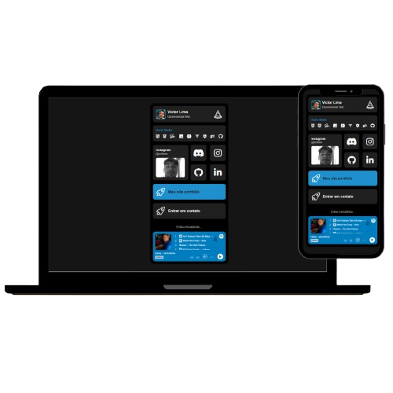

 
<h1 align="center">Link Bio</h1>

Estou lançando uma nova página de links para simplificar o acesso às minhas redes sociais. Optei por um design simples e minimalista, incorporando tecnologias com as quais tenho grande familiaridade. Essa abordagem não só facilita a navegação, mas também proporciona uma maneira eficiente de me conectar através de várias plataformas. Convido todos a explorarem e se conectarem comigo através dessa página!
 

    

## 🛸 Tecnologias

Este projeto foi desenvolvido com as seguintes tecnologias:

- HTML e CSS  
- Javascript 
- Git e Github  

## 🖥️ Projeto 

- [Da uma olhada ai](https://link-bio-lemon.vercel.app/)

Feito com ♥ por Victor Lima
